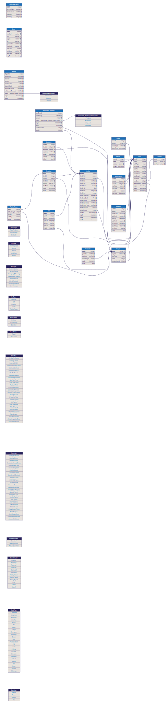

## Schema

[DBML](https://dbml.dbdiagram.io/home/), a database markup syntax supported with <https://dbdiagram.io>

## Useful Tools

- <https://github.com/softwaretechnik-berlin/dbml-renderer> renders DBML into SVG images
- <https://marketplace.visualstudio.com/items?itemName=duynvu.dbml-language> syntax highlighting for DBML on VSCode
- <https://marketplace.visualstudio.com/items?itemName=nicolas-liger.dbml-viewer> real-time `.dbml` file render for VSCode
